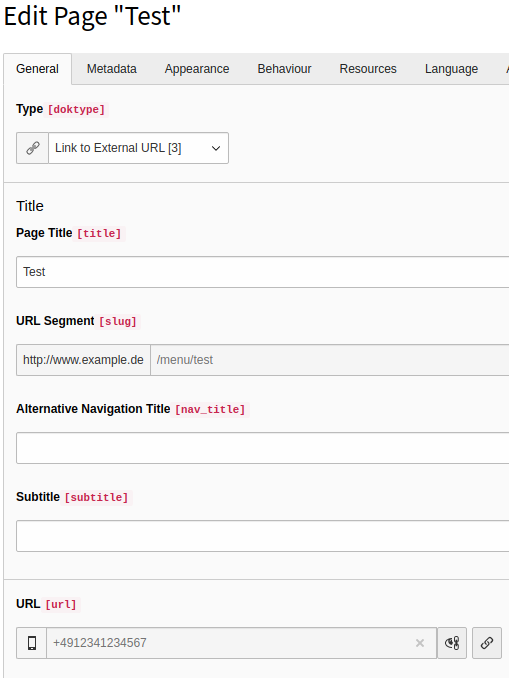

# TYPO3 Extension doktype_typolink

Enhances doktype 3 ("Link to External URL") to support typolinks. So there's no need for hard coded absolute URLs in menus anymore.

It's a tiny change in TCA but enables to BE users to use the power of the typolink link browser.

| Before | After |
| ------ | ----- |
|  |  |
